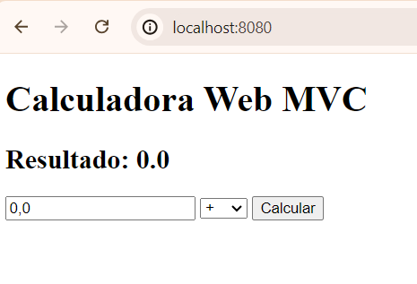
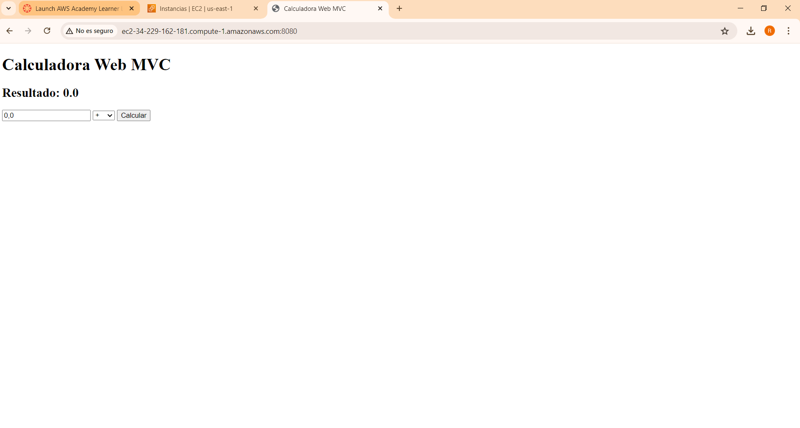
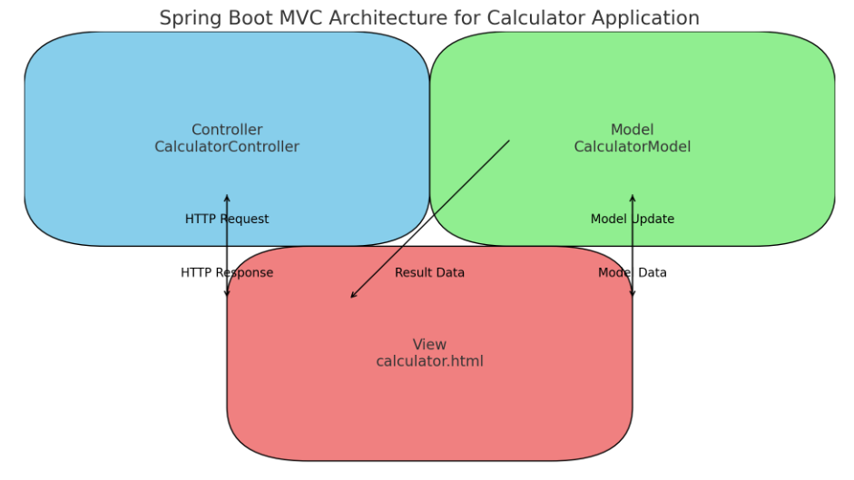
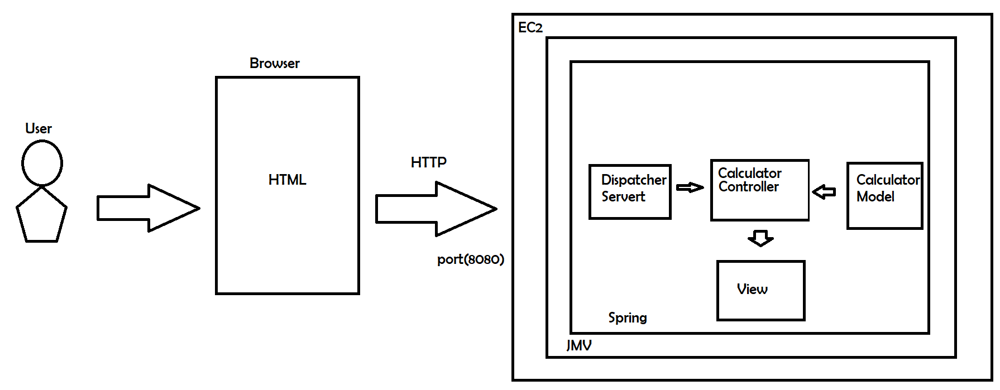

# CalculatorWebMVC Spring Boot Application

This proyect hosts a Spring Boot application that features a basic web calculator. The calculator supports essential arithmetic operations including addition, subtraction, multiplication, division, and reset (All Clear). The application is designed using the Model-View-Controller (MVC) architecture to distinctly separate the application's logic, user interface, and user input processing.

### Features
+ **Addition:** Perform addition of numbers.
+ **Subtraction:** Execute subtraction of numbers.
+ **Multiplication:** Carry out multiplication of numbers.
+ **Division:** Divide numbers with safeguards to avoid division by zero.
+ **All Clear:** Reset the calculator to its default state.


## Starting

In order to use the project on your system, you can access the following link and download a compressed file of it.

[Repository](https://github.com/Richi025/CalculatorWebMvc.git/) 

You can also clone the file using the following command.

```
git clone https://github.com/Richi025/CalculatorWebMvc.git 
```

### Previous requirements

It is necessary to have "**Maven**" and "**Java**" installed, preferably in their latest versions.

#### Maven
```
Download Maven at http://maven.apache.org/download.html 

Follow the instructions at http://maven.apache.org/download.html#Installation
```
#### Java

```
Download Java at https://www.java.com/es/download/ie_manual.jsp
```


### Installing

Once you have the cloned project in your repository. Follow the steps below to launch the program successfully

1. Open a terminal and enter the folder where I clone the repository.

2. Use the following command to compile and clean the target directory.
    ```
    mvn clean compile
    ```
3. Now use the following command to package the project as a JAR file.

    ```
    mvn package

    ```

4. Now you can run the project using the following command.

    ```
    mvn exec:java

    or

    java -jar .\target\CalculatorWebMvc-1.0-SNAPSHOT.jar 
    ```

5. Once the program is running, open a browser and enter the following links.

     http://localhost:8080/


    

6. And the execution in AWS:

    

## Proyect Structure

* CalculartoApp.java : Main application class for the Spring Boot application.

* Controller: CalculatorController

  + Handles HTTP requests and responses.
  + Communicates with the Model to perform calculations and update the result.

* Model: CalculatorModel

  + Represents the state of the calculator.
  + Uses the Singleton pattern to ensure a single instance.
  + Stores the current result of the calculations.

* View: calculator.html

  + Thymeleaf template for rendering the calculator interface.
  + Displays the current result and provides input fields for user interaction.


## Architectural Design






### Data flow

+ User Interaction: Users interact with the web page (calculator.html), through the public URL of the EC2 instance, entering numbers and selecting operations.
+ View to Controller: The request arrives at Spring's DispatcherServlet, Form submission sends data to the CalculatorController.
+ Controller Processing: The calculate method in the CalculatorController processes the input and updates the CalculatorModel.
+ Model Update: CalculatorModel stores the calculation result.
+ Controller to View: The updated model attributes are returned to the view, displaying the result to the use.

## Built with

* [Maven](https://maven.apache.org/) - Dependency management
* [java](https://www.java.com/es/) - Programming language
* [Spring boot](https://start.spring.io/) - Framework

### Technologies Used
+ **Java:** Programming language.
+ **Spring Boot:** Framework for building the application.
+ **Thymeleaf:** Template engine for rendering the HTML views.
+ **CSS:** Styling the application.

## Versioned

We use [Git](https://github.com/) for version control. For available versions, see the tags in this repository.

## Authors

* **Jose Ricardo Vasquez Vega** - [Richi025](https://github.com/Richi025)

## Date

Tuesday, June 25, 2024

## License

This project is licensed under the GNU license; See the [LICENSE.txt](LICENSE.txt) file for details.